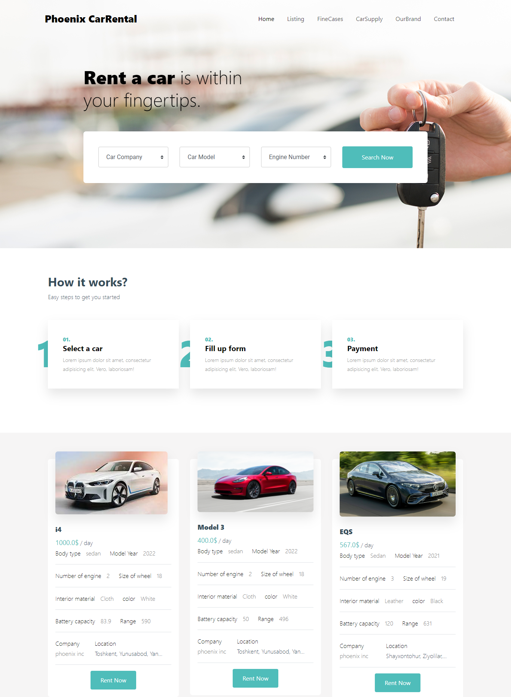
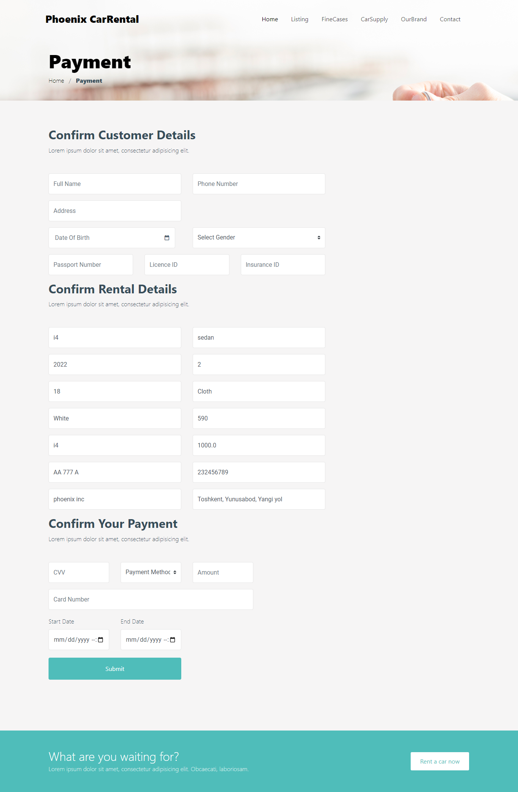

<div align="center">


# Database Application & Design
[202201-SOC3060-003]:
# Car Rental Project of Team 3
</div>

### Cloning the repository

--> Clone the repository using the command below :
```bash
git clone https://github.com/Abdulaziz0098/car_rental.git

```

--> Move into the directory where we have the project files : 
```bash
cd car_rental

```

--> Create a virtual environment :
```bash
# make sure you installed python and install virtualenv first
pip install virtualenv

# Then we create our virtual environment
virtualenv env /or python -m venv env 

```

--> Activate the virtual environment :
```bash
for windows users: env\scripts\activate
for mac users: env\bin\activate

```

--> Install the requirements :
```bash
pip install -r requirements.txt
create mysql database for this project an make changes in car_rental\settings.py as follow

DATABASES = {
    'default': {
        'ENGINE': 'django.db.backends.mysql',
        'NAME': 'Database Name',
        'USER': 'Mysql USER',
        'PASSWORD': 'Your USER password',
        'HOST': 'localhost',
        'PORT': 'PORT Number',
    }
}
After setting database in to project run in project diractory cmd and run following command
python manage.py migrate


```

#

### Running the App

--> To run the App, we use :
```bash
python manage.py runserver

```

> ⚠ Then, the development server will be started at http://127.0.0.1:8000/

#

### App Preview :

<table width="100%"> 
<tr>
<td width="50%">      
&nbsp; 
<br>
<p align="center">
  Main Page
</p>

</td> 
<td width="50%">
<br>
<p align="center">
  Car renting page
</p>
  
</td>
</table>


